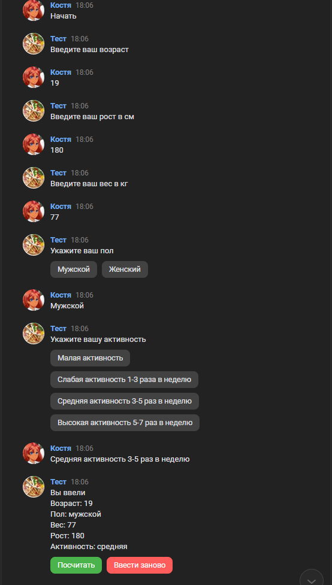
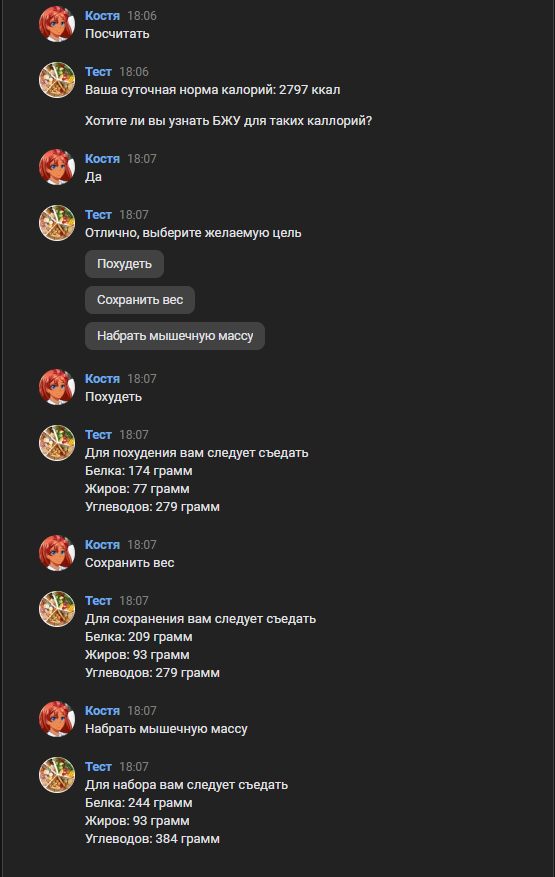

# vk-bot-api
 
This is a simple bot for VK social network, which allows users to calculate their daily calorie needs according to their age, gender, height, weight, and physical activity.

## Goal

The goal was to create a bot using the minimum amount of external libraries.

## Tasks:
* learning VK-API
* learning Long Poll request

## Screenshots

  
  

